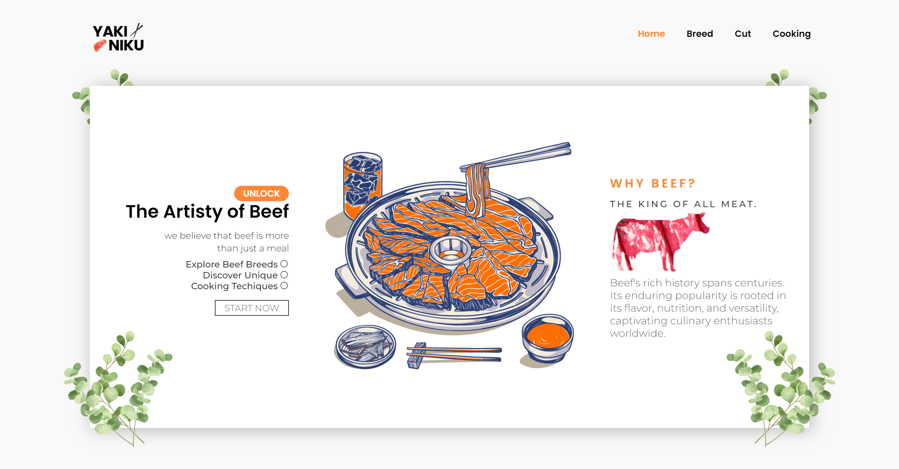

# F2CEDT_FINAL

This is a final project of F2CEDT  _this is our landing page_

## Preview

<div align="center">


</div>

### Mobile


## GUIDE

### To start front-end server

```shell
cd .\frontend\
npm install
npm start #or npm run dev
```

### To start back-end server

```shell
cd .\backend\
npm install
npm start #or npm run dev
```

### We also need MongoDB

```shell
cd .\backend\
docker-compose up
```
